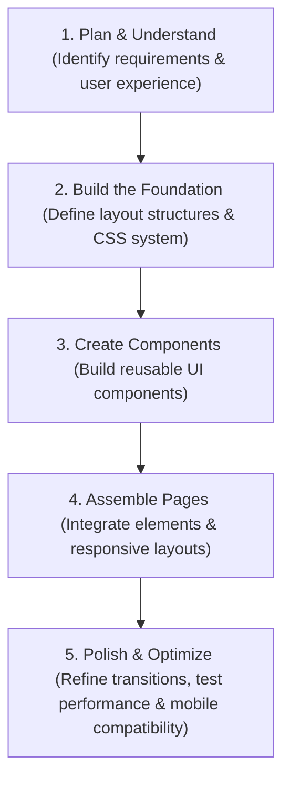

# Portfolio Jag - Design Patterns & Guidelines

This document defines the UI/UX design patterns, styling tokens, and guidelines to ensure a premium, modern user experience for the J.A.G. Portfolio.

## 1. Design Aesthetics & Visual Tokens

The website must deliver a high-end, premium experience that wows the user immediately.

### Color Palette
- Avoid generic colors (plain red, blue, green).
- Use curated, harmonious color palettes (HSL-based, deep rich colors) and sleek dark modes.

### Glassmorphism
- Use semi-transparent backgrounds with backdrop blur filters and subtle borders to create depth:
  ```css
  background: rgba(255, 255, 255, 0.05);
  backdrop-filter: blur(10px);
  border: 1px solid rgba(255, 255, 255, 0.1);
  ```

### Typography
- Rely on the project's custom fonts (`PerfectlySplendid` and `HelveticaNeueLight`) defined in `css/style.css`.
- Avoid default browser fallback styling for headers, navigation elements, and captions.

## 2. Dynamic Design & Interactivity

The interface should feel alive, responsive, and tactile.

### Micro-Animations
- Add subtle transitions on interactive elements (buttons, links, active slides) to improve engagement:
  ```css
  transition: all 0.3s cubic-bezier(0.25, 0.8, 0.25, 1);
  ```
- Use smooth bezier curves rather than linear transitions for a more organic feel.

### Hover & Active States
- Provide clear visual feedback on hover and active actions (e.g., scaling, opacity shifts, slide translations).
- Use the `.active` and `.next` class states to trigger smooth transition animations.

## 3. SEO & Semantic Best Practices

Automatically implement SEO best practices across the portfolio site:
- **Title Tags**: Include descriptive and unique `<title>` tags for each section/state if applicable.
- **Meta Descriptions**: Add compelling meta descriptions that summarize the site's content.
- **Heading Structure**: Maintain exactly one `<h1>` per page, followed by properly nested headings (`<h2>`, `<h3>`).
- **Semantic HTML**: Structure the DOM with semantic tags (like `<header>`, `<main>`, `<section>`, `<footer>`) to aid readability, SEO, and screen readers.
- **Unique IDs**: All interactive elements (navigation buttons, links, toggles) must have unique, descriptive IDs for browser testing and accessibility.

## 4. Implementation Workflow

When building or modifying features, adhere to the following sequence:



1. **Plan & Understand**: Identify requirements, align on the user experience, and mock up the layout.
2. **Build the Foundation**: Define layout structures and CSS variables/classes.
3. **Create Components**: Build UI components with strict adherence to styling conventions.
4. **Assemble Pages**: Integrate elements, configure routing/animations, and verify responsive behaviors.
5. **Polish & Optimize**: Adjust performance, verify mobile responsiveness, test media loads, and eliminate transition delays.
